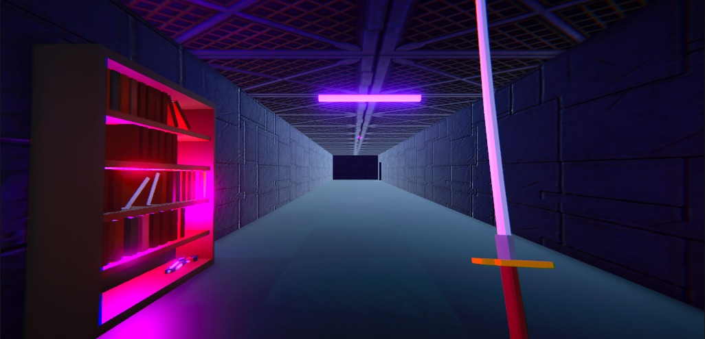

# ⚔️ KatanaMadJackZERO

Protótipo de Jogo feito na Unity, no estilo BoomerSlasher, com estética retrô e gameplay inspirada em Katana Zero, Mullet Madjack e DOOM 64. Sinópse: Um cara com Mullet maneiro, luta contra Fãs raivosos do Lex Luthor, é mais um dia normal, eu acho...
 

---

## 📸 Demonstração


<p align="center">
  
  
</p>


---

## 🛠 Tecnologias Utilizadas

- [Unity](https://unity.com/) (versão 6000.0.49f1)
- Linguagem: **C#**


---

## 🚀 Como Rodar o Projeto

Clone este repositório e abra o projeto no Unity:

```bash
git clone https://github.com/HiioCom2i/KatanaMadJackZERO.git
cd KatanaMadJackZERO
